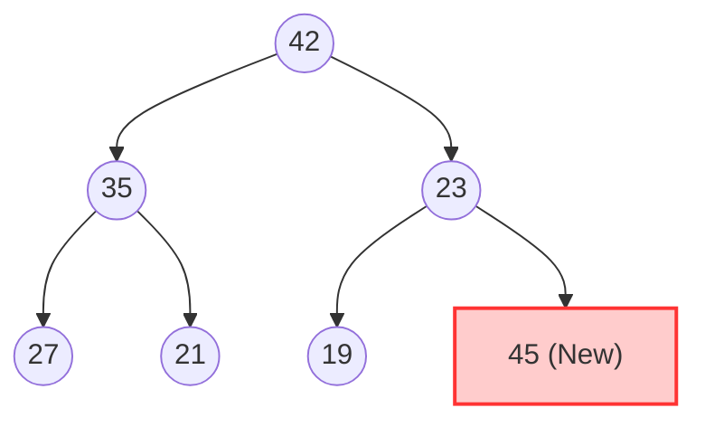

> [!WARNING]
> **DRAFT / UNVERIFIED:** This chapter is currently under review and may contain factual errors. Please do not use this as a definitive reference until this warning is removed.

# Heap & Priority Queue Study Guide

## 1. Theoretical Background

### Binary Tree Terminology
Before understanding Heaps, it is critical to review binary tree definitions:
* **Full Binary Tree**: A binary tree in which every node has either $0$ or $2$ children. No node has only one child.
* **Complete Binary Tree**: A binary tree that is either full or full through the next-to-last level, with the last level filled from left to right (leaves are pushed as far to the left as possible).

### What is a Heap?
A **Heap** is a complete binary tree that satisfies the **Heap Property**:
* **Max Heap Property**: For every node $i$ other than the root, $\text{value}(parent(i)) \ge \text{value}(i)$. The largest element is always at the root.
* **Min Heap Property**: For every node $i$ other than the root, $\text{value}(parent(i)) \le \text{value}(i)$. The smallest element is always at the root.

---

## 2. Array-Based Representation

A heap is a complete binary tree, which makes it highly suitable for representation using a contiguous array. This eliminates pointer storage overhead, saving memory.

For a **0-based indexed array**:
* **Left Child of node at index $i$**:
  $$\text{left}(i) = 2i + 1$$
* **Right Child of node at index $i$**:
  $$\text{right}(i) = 2i + 2$$
* **Parent of node at index $i$**:
  $$\text{parent}(i) = \lfloor \frac{i - 1}{2} \rfloor \quad \text{(integer division)}$$

### Leaf Node Bounds
In a complete binary tree of size $N$:
* The leaf nodes reside in the index range:
  $$\lfloor N/2 \rfloor \text{ to } N - 1$$
* The non-leaf (internal) nodes reside in the index range:
  $$0 \text{ to } \lfloor N/2 \rfloor - 1$$

> [!NOTE]
> **Proof**: Let index $i = \lfloor N/2 \rfloor$. Its left child is at index $2 \lfloor N/2 \rfloor + 1$. 
> * If $N$ is even, $2(N/2) + 1 = N + 1 > N - 1$.
> * If $N$ is odd, $2((N-1)/2) + 1 = N > N - 1$.
> Since the left child index is out of bounds ($\ge N$), node $i$ cannot have any children, making it and all subsequent nodes leaf nodes.

---

## 3. Heap Operations

### 3.1 Up-Heapify (Reheapification Upward / Sift-Up / Bubble-Up)
Used during insertion (`push`) to restore the heap property after adding a new element at the end of the array.

#### Algorithm Steps (for Max Heap):
1. Insert the new element at the next available position at the end of the array.
2. Compare the inserted element with its parent:
   - If the element is greater than its parent, swap them.
   - If not, or if the element has reached the root (index 0), terminate.
3. Repeat step 2 recursively or iteratively on the parent's index.

* **Time Complexity**: $O(\log N)$ (since the maximum height of a complete binary tree is $\lfloor \log_2 N \rfloor$).


*Step 1: Insert 45 at end. Step 2: Compare 45 with parent 23, swap them. Compare 45 with root 42, swap them.*

---

### 3.2 Down-Heapify (Reheapification Downward / Sift-Down / Bubble-Down)
Used during removal (`pop`) of the root element to restore the heap property.

#### Algorithm Steps (for Max Heap):
1. Replace the root element with the last element of the heap.
2. Remove the last element (reducing heap size by 1).
3. Compare the current node (at the root) with its children:
   - Identify the **larger** child.
   - If the current node is smaller than the larger child, swap them.
   - If the current node is greater than or equal to both children, or has no children (is a leaf), terminate.
4. Repeat step 3 on the index of the swapped child.

* **Time Complexity**: $O(\log N)$.

> [!IMPORTANT]
> Always swap with the **larger child** in a Max Heap (or the **smaller child** in a Min Heap). Swapping with the incorrect child will violate the heap property on the other sibling's subtree.

---

## 4. Heap Sort Algorithm

Heap Sort is a comparison-based, in-place sorting algorithm that uses a binary heap structure.

### Sorting Steps:
1. **Build Heap**: Convert the unsorted array of size $N$ into a Max Heap.
   - To do this efficiently in $O(N)$ time, start from the last non-leaf node at index $\lfloor N/2 \rfloor - 1$ and perform `down-heapify` on each node going backwards to index 0.
2. **Sort**:
   - Swap the root (maximum element) with the last element of the active heap (at index $i$, starting from $N - 1$ down to 1).
   - Reduce the active heap size by 1.
   - Perform `down-heapify` on the new root (index 0) to restore the heap property for the active subarray.
   - Repeat until the active heap size is 1.

### Complexity Analysis
| Metric | Time/Space Complexity | Notes |
|---|---|---|
| **Build Heap Complexity** | $O(N)$ | Formally $\sum_{h=0}^{\lfloor\log N\rfloor} \frac{N}{2^{h+1}} O(h) = O(N)$ |
| **Sorting Complexity** | $O(N \log N)$ | $N-1$ extract-max steps, each costing $O(\log N)$ |
| **Total Time Complexity** | $O(N \log N)$ | Same for Best, Average, and Worst cases |
| **Space Complexity** | $O(1)$ | Done in-place within the input array |

---

## 5. Complete C++ Templated Class Implementation

Here is a standard C++ implementation of a `MaxHeap` class, including constructors, mutators, accessors, guard clauses, and private heapification utilities.

```cpp
#pragma once

#include <vector>
#include <stdexcept>
#include <algorithm>
#include <iostream>

template <typename T>
class MaxHeap {
private:
    std::vector<T> heap;

    // Helper functions for index calculations
    size_t parent(size_t i) const { return (i - 1) / 2; }
    size_t leftChild(size_t i) const { return 2 * i + 1; }
    size_t rightChild(size_t i) const { return 2 * i + 2; }

    // Restores the heap property upward from a given index
    void upHeapify(size_t index) {
        while (index > 0 && heap[index] > heap[parent(index)]) {
            std::swap(heap[index], heap[parent(index)]);
            index = parent(index);
        }
    }

    // Restores the heap property downward from a given index
    void downHeapify(size_t index, size_t heapSize) {
        size_t maxIndex = index;
        size_t left = leftChild(index);
        size_t right = rightChild(index);

        if (left < heapSize && heap[left] > heap[maxIndex]) {
            maxIndex = left;
        }
        if (right < heapSize && heap[right] > heap[maxIndex]) {
            maxIndex = right;
        }

        if (index != maxIndex) {
            std::swap(heap[index], heap[maxIndex]);
            downHeapify(maxIndex, heapSize);
        }
    }

public:
    // Default constructor
    MaxHeap() = default;

    // O(N) Bottom-up Heap Construction
    MaxHeap(const std::vector<T>& array) {
        heap = array;
        if (!heap.empty()) {
            // Start heapifying from the last non-leaf node down to the root
            for (long long i = static_cast<long long>(heap.size()) / 2 - 1; i >= 0; --i) {
                downHeapify(static_cast<size_t>(i), heap.size());
            }
        }
    }

    // Insert an element: O(log N)
    void push(const T& val) {
        heap.push_back(val);
        upHeapify(heap.size() - 1);
    }

    // Remove the max element: O(log N)
    void pop() {
        if (empty()) {
            throw std::underflow_error("Heap underflow: Cannot pop from an empty heap.");
        }
        // Swap root with the last element
        std::swap(heap[0], heap[heap.size() - 1]);
        heap.pop_back(); // Remove last element
        if (!empty()) {
            downHeapify(0, heap.size());
        }
    }

    // Access the max element: O(1)
    const T& top() const {
        if (empty()) {
            throw std::out_of_range("Heap is empty: No top element available.");
        }
        return heap[0];
    }

    // Check if empty: O(1)
    bool empty() const {
        return heap.empty();
    }

    // Get size: O(1)
    size_t size() const {
        return heap.size();
    }

    // Perform Heap Sort in-place on a vector
    static void heapSort(std::vector<T>& array) {
        size_t n = array.size();
        if (n <= 1) return;

        // Step 1: Build Max Heap
        // We call a lambda down-heapify or a local version helper
        auto localDownHeapify = [&](auto& self, size_t idx, size_t size) -> void {
            size_t maxIdx = idx;
            size_t left = 2 * idx + 1;
            size_t right = 2 * idx + 2;

            if (left < size && array[left] > array[maxIdx]) maxIdx = left;
            if (right < size && array[right] > array[maxIdx]) maxIdx = right;

            if (idx != maxIdx) {
                std::swap(array[idx], array[maxIdx]);
                self(self, maxIdx, size);
            }
        };

        for (long long i = static_cast<long long>(n) / 2 - 1; i >= 0; --i) {
            localDownHeapify(localDownHeapify, static_cast<size_t>(i), n);
        }

        // Step 2: Extract elements from heap one by one
        for (size_t i = n - 1; i > 0; --i) {
            std::swap(array[0], array[i]);
            localDownHeapify(localDownHeapify, 0, i);
        }
    }
};
```

---

## 6. Practical LeetCode Exercises & Case Studies

To consolidate heap concepts, study the following implementations and traces:

1. **[LeetCode 215: Kth Largest Element in an Array (Medium)](file:///Users/miyaks/Desktop/self-learn-1/the_BibleOfDataStructure/leetcode/6_HEAP/no1_kth_largest.cpp)**
   - **Concept:** Max-Heap or Min-Heap size capping to find the $K$-th largest element in $\mathcal{O}(N \log K)$ time.
2. **[LeetCode 23: Merge K Sorted Lists (Hard)](file:///Users/miyaks/Desktop/self-learn-1/the_BibleOfDataStructure/leetcode/6_HEAP/no2_merge_k.cpp)**
   - **Concept:** Multi-way merge using a min-heap to keep track of the smallest node pointers from $K$ lists in $\mathcal{O}(N \log K)$ time.
3. **[Custom Implementation: Heap Sort (Medium)](file:///Users/miyaks/Desktop/self-learn-1/the_BibleOfDataStructure/leetcode/6_HEAP/no3_heapsort.cpp)**
   - **Concept:** Build a heap in-place in $\mathcal{O}(N)$ and repeatedly extract elements in $\mathcal{O}(N \log N)$ total time.
4. **[LeetCode 295: Find Median from Data Stream (Hard)](file:///Users/miyaks/Desktop/self-learn-1/the_BibleOfDataStructure/leetcode/6_HEAP/no4_median.cpp)**
   - **Concept:** Two-heap design (a max-heap for the smaller half and a min-heap for the larger half) to find the median in $\mathcal{O}(1)$ query time and $\mathcal{O}(\log N)$ insertion time.
5. **[LeetCode 347: Top K Frequent Elements (Medium)](file:///Users/miyaks/Desktop/self-learn-1/the_BibleOfDataStructure/leetcode/6_HEAP/no5_top_k.cpp)**
   - **Concept:** Frequency hashing followed by pushing frequency-value pairs into a min-heap capped at size $K$ to solve in $\mathcal{O}(N \log K)$ time.
6. **[LeetCode 621: Task Scheduler (Medium)](file:///Users/miyaks/Desktop/self-learn-1/the_BibleOfDataStructure/leetcode/6_HEAP/no6_task_scheduler.cpp)**
   - **Concept:** Max-heap based execution simulation of tasks with cooldown intervals in $\mathcal{O}(N)$ time (since unique task characters are limited to 26).
7. **[LeetCode 973: K Closest Points to Origin (Medium)](file:///Users/miyaks/Desktop/self-learn-1/the_BibleOfDataStructure/leetcode/6_HEAP/no7_k_closest_points.cpp)**
   - **Concept:** Maintaining a max-heap of size $K$ to find the $K$ points with the smallest squared Euclidean distance in $\mathcal{O}(N \log K)$ time.

---

## 7. Deep-Dive Case Studies of New Problems

### 7.1 LeetCode 295: Find Median from Data Stream (Hard)

#### Problem Definition
Given a continuously growing stream of numbers, design a data structure that returns the median of the elements processed so far in $\mathcal{O}(1)$ time, and handles insertion in $\mathcal{O}(\log N)$ time.

#### Design Strategy: The Two-Heap Pattern
If we store all numbers in a sorted list, insertion would take $\mathcal{O}(N)$ time (even with binary search, shifting elements takes linear time). Instead, we divide the data stream into two halves:
1. **Lower Half (Left Side):** Stored in a **Max-Heap**.
2. **Upper Half (Right Side):** Stored in a **Min-Heap**.

```mermaid
graph LR
    subgraph Max-Heap (Lower Half)
    A((Max Value))
    end
    subgraph Min-Heap (Upper Half)
    B((Min Value))
    end
    
    A -.5|Median is Mean if even| B
    style A fill:#ffdddd,stroke:#333
    style B fill:#ddffdd,stroke:#333
```

By structuring it this way:
- The maximum of the lower half is accessible at the top of the **Max-Heap**.
- The minimum of the upper half is accessible at the top of the **Min-Heap**.
- To find the median:
  - If the heaps are of equal size, the median is the average of their tops: `(maxHeap.top() + minHeap.top()) / 2.0`.
  - If one heap has more elements (we design it so `maxHeap` stores the extra element when the total size is odd), the median is `maxHeap.top()`.

#### Balancing Algorithm (Insertion Steps)
To keep the properties valid, we perform the following steps for each `addNum(num)`:
1. **Insert**: Push `num` into `maxHeap`.
2. **Rebalance Ordering**: Push `maxHeap.top()` into `minHeap`, and pop `maxHeap`. This ensures that the elements in `minHeap` are strictly greater than or equal to the elements in `maxHeap`.
3. **Rebalance Size**: If `minHeap.size() > maxHeap.size()`, pop `minHeap.top()` and push it to `maxHeap`. This guarantees that `maxHeap.size() >= minHeap.size()` and their size difference is at most 1.

---

### 7.2 LeetCode 347: Top K Frequent Elements (Medium)

#### Problem Definition
Given an integer array `nums` and an integer `k`, return the $k$ most frequent elements in the array. Your solution must run in better than $\mathcal{O}(N \log N)$ time.

#### Design Strategy: Min-Heap of Size $K$
A naive approach would be to calculate frequencies using a hash map, and then sort the entries by frequency. This would require $\mathcal{O}(U \log U)$ time, where $U$ is the number of unique elements.

Instead, we can use a **Min-Heap** capped at size $K$:
1. **Count Frequencies**: Iterate through the array and store counts in a hash map `frequencyMap` ($\mathcal{O}(N)$ time).
2. **Push to Min-Heap**: Iterate through the unique elements in the map. For each element, insert its `(frequency, value)` pair into the Min-Heap.
3. **Cap the size**: If `minHeap.size() > k`, pop the top element. Since this is a min-heap, the element at the top has the lowest frequency among all elements currently in the heap. Popping it leaves the $k$ most frequent elements.
4. **Collect Results**: Empty the min-heap to form the final result array.

#### Complexity Analysis
- **Time Complexity**: $\mathcal{O}(N + U \log k)$, where $U$ is the number of unique elements. Since $U \le N$ and $k \le N$, this is strictly better than $\mathcal{O}(N \log k)$ or $\mathcal{O}(N \log N)$.
- **Space Complexity**: $\mathcal{O}(U + k)$ to store frequencies and heap elements, which is $\mathcal{O}(N)$ in the worst-case.

---

### 7.3 LeetCode 621: Task Scheduler (Medium)

#### Problem Definition
Given a list of CPU tasks represented by characters and a cooldown period $n$ between identical tasks, find the minimum number of units of time (CPU intervals) required to complete all tasks.

#### Design Strategy: Max-Heap Simulation
A greedy strategy works best: at any point, we want to prioritize tasks that have the highest remaining frequencies. This reduces the risk of being forced into idle periods later.
1. **Count Frequencies:** Count frequencies of each character task in a hash map or frequency array.
2. **Initialize Max-Heap:** Insert positive frequencies into a Max-Heap.
3. **Execute Cycle:** Run cycles of duration $n + 1$ (the cooldown window):
   - Pop the most frequent tasks from the heap one by one (up to $n + 1$ unique tasks).
   - Decrement their counts. If a task's remaining count is $> 0$, store it in a temporary list.
   - The number of tasks executed in this cycle is $T_{active}$.
   - If the heap becomes completely empty and there are no tasks in the temporary list, we add $T_{active}$ to total time (no trailing idle cycles).
   - Otherwise, we must spend the full $n + 1$ time slots for this cycle (meaning we idled for $(n + 1) - T_{active}$ slots).
   - Push the temporary tasks back into the Max-Heap and repeat until the heap is empty.

#### Complexity Analysis
- **Time Complexity:** $\mathcal{O}(N)$, where $N$ is the number of tasks. Since there are at most 26 unique uppercase letters, heap operations (pop/push) are bounded by $\mathcal{O}(\log 26) = \mathcal{O}(1)$.
- **Space Complexity:** $\mathcal{O}(1)$ auxiliary space because the heap and frequency tables contain at most 26 elements.

---

### 7.4 LeetCode 973: K Closest Points to Origin (Medium)

#### Problem Definition
Given a list of coordinate points $[x_i, y_i]$ and an integer $K$, return the $K$ points closest to the origin $(0, 0)$ based on Euclidean distance.

#### Design Strategy: Max-Heap of Size $K$
Instead of sorting all points (which takes $\mathcal{O}(N \log N)$ time), we can maintain a **Max-Heap** of size $K$ to keep track of the $K$ smallest distances:
1. **Define Distance Metric:** We use the squared Euclidean distance ($x^2 + y^2$) to avoid floating-point rounding issues and compute-heavy square roots.
2. **Process Points:** For each point:
   - Compute its squared distance and push the pair `(dist_squared, index)` into the Max-Heap.
   - If the size of the Max-Heap exceeds $K$, pop the top element. Since it is a Max-Heap, the top element has the largest distance among our current pool of $K+1$ candidates. Popping it leaves only the $K$ closest candidates.
3. **Retrieve Results:** Extract the index references from the remaining $K$ elements in the heap to form the output.

```mermaid
graph TD
    subgraph Max-Heap (stores K elements)
    A["Top (Largest of the K smallest distances)"]
    B["Distance 2"]
    C["Distance 3"]
    A --> B
    A --> C
    end
    
    NewPoint["New Point"] -->|If dist < Top| Swap["Pop Top, Push New Point"]
    NewPoint -->|If dist >= Top| Ignore["Ignore/Discard Point"]
```

#### Complexity Analysis
- **Time Complexity:** $\mathcal{O}(N \log K)$ because we iterate through $N$ elements, inserting each into a heap of size at most $K$.
- **Space Complexity:** $\mathcal{O}(K)$ auxiliary space to store the $K$ elements in the Max-Heap.

