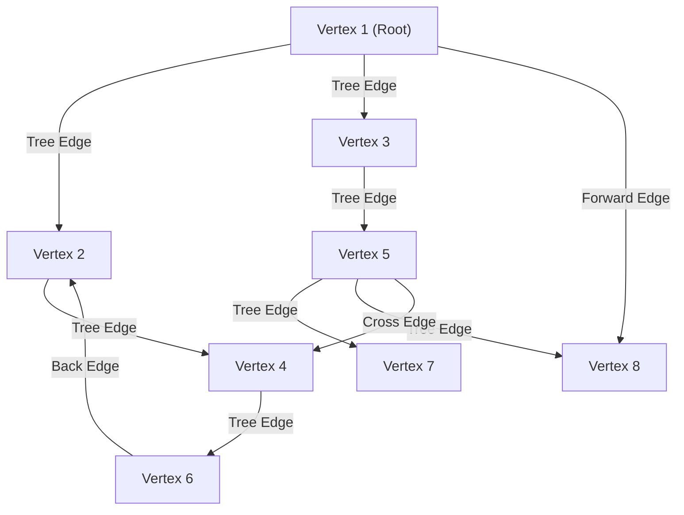

# Study Guide: Graphs (Part I & II)

Welcome to the ultimate study guide for **Graphs**. This document covers foundational graph theory, representations, traversal algorithms (DFS & BFS), edge classifications, topological sorting, and transitive closure (Warshall's Algorithm). Full templated C++ implementations are included.

---

## 1. Graph Definitions & Taxonomy

A **graph** $G = (V, E)$ consists of:
*   **$V$**: A finite, non-empty set of **vertices** (or nodes).
*   **$E$**: A set of **edges** (or arcs) connecting pairs of vertices. Each edge is represented as a pair $(v, w)$ where $v, w \in V$.

### Key Terminology
*   **Directed Graph (Digraph)**: A graph where edges have a direction. The pair $(v, w)$ is ordered; the edge goes from $v$ (source) to $w$ (destination).
*   **Undirected Graph**: A graph where edges have no direction. The pair $(v, w)$ is unordered, meaning $(v, w)$ and $(w, v)$ represent the same bidirectional edge.
*   **Adjacency**: 
    *   In a directed graph, vertex $w$ is **adjacent to** $v$ if and only if $(v, w) \in E$.
    *   In an undirected graph, if $(v, w) \in E$, then $v$ is adjacent to $w$ and $w$ is adjacent to $v$.
*   **Weighted Graph**: A graph where each edge has a third component, a numerical weight or cost (e.g., distance, travel time, flight cost).
*   **Unweighted Graph**: A graph where all edges are considered equal (effectively having a weight of $1$).
*   **Simple Graph**: A graph with no self-loops (edges of the form $(v, v)$) and no parallel edges (multiple edges connecting the same pair of vertices).
*   **Complete Graph**: A graph where there is an edge between every pair of vertices.
    *   For an undirected complete graph with $n$ vertices, the number of edges is $\frac{n(n - 1)}{2}$.
    *   For a directed complete graph with $n$ vertices, the number of edges is $n(n - 1)$.
*   **Degree of a Vertex**:
    *   **Undirected Graph**: The number of edges connected to that vertex.
        *   **Odd Vertex**: A vertex with an odd degree.
        *   **Even Vertex**: A vertex with an even degree.
    *   **Directed Graph**: Divided into:
        *   **In-degree**: The number of incoming edges pointing *to* the vertex.
        *   **Out-degree**: The number of outgoing edges pointing *from* the vertex.
*   **Subgraph**: $G' = (V', E')$ is a subgraph of $G = (V, E)$ if $V' \subseteq V$ and $E' \subseteq E$.
*   **Connected Graph**: An undirected graph is connected if there is a path between every pair of vertices. A directed graph is:
    *   **Strongly Connected**: If there is a directed path from $u$ to $v$ and from $v$ to $u$ for all pairs $u, v \in V$.
    *   **Weakly Connected**: If the underlying undirected graph (ignoring edge directions) is connected.

---

## 2. Graph Connectivity: Walks, Trails, Paths, Cycles, and Circuits

Understanding the distinction between these traversal sequences is critical for exams:

| Concept | Repeated Edges Allowed? | Repeated Vertices Allowed? | Open / Closed | Notes |
| :--- | :--- | :--- | :--- | :--- |
| **Walk** | Yes | Yes | Either | Any sequence of vertices and edges. |
| **Trail** | **No** | Yes | Open | An open walk where no edge is repeated. |
| **Circuit** | **No** | Yes | **Closed** | A closed trail (starts and ends at the same vertex, no repeated edges). |
| **Path** | **No** | **No** | Open | No repeated vertices (which automatically implies no repeated edges). |
| **Cycle** | **No** | **No** (except start/end) | **Closed** | Starts and ends at the same vertex, with no other repeated vertices or edges. |

---

## 3. Graph Representations

There are two primary methods for storing graphs in memory:

### A. Adjacency Matrix
A 2D array `A` of size $|V| \times |V|$:
*   For an unweighted graph: `A[u][v] = true` if edge $(u, v)$ exists, else `false`.
*   For a weighted graph: `A[u][v] = weight`. Non-existent edges are represented by a sentinel value:
    *   $\infty$ (or a very large number) if searching for the cheapest paths.
    *   $-\infty$ (or $0$) if searching for the most expensive paths.

#### Complexity
*   **Space Complexity**: $O(|V|^2)$
*   **Time Complexity**:
    *   Add Edge: $O(1)$
    *   Remove Edge: $O(1)$
    *   Check if adjacent ($u \to v$): $O(1)$
    *   Find all neighbors of $u$: $O(|V|)$
    *   Add Vertex: $O(|V|^2)$ (requires resizing the 2D matrix)
    *   Delete Vertex: $O(|V|^2)$ (requires deleting a row and column and shifting elements)

### B. Adjacency List
An array (or vector) of size $|V|$, where each element index $u$ points to a linked list containing all vertices $v$ adjacent to $u$. For weighted graphs, the linked list nodes store pairs of `(destination, weight)`.

#### Complexity
*   **Space Complexity**: $O(|V| + |E|)$
*   **Time Complexity**:
    *   Add Edge: $O(1)$ (inserting to the front/end of a linked list)
    *   Remove Edge: $O(\text{deg}(u))$ (searching the list)
    *   Check if adjacent ($u \to v$): $O(\text{deg}(u))$
    *   Find all neighbors of $u$: $O(\text{deg}(u))$
    *   Add Vertex: $O(1)$ amortized (resizing the list of headers)
    *   Delete Vertex: $O(|V| + |E|)$ (requires searching and removing references in all other lists)

---

## 4. Graph Traversals

### Depth-First Search (DFS)
*   **Strategy**: Traverses "deepward" along a branch before backtracking.
*   **Data Structure**: Uses a **Stack** (implicitly via recursion or explicitly).
*   **Application**: Path finding, cycle detection, topological sorting, finding strongly connected components.
*   **Time Complexity**: 
    *   Adjacency List: $O(|V| + |E|)$
    *   Adjacency Matrix: $O(|V|^2)$

### Breadth-First Search (BFS)
*   **Strategy**: Traverses "breadthward", visiting all immediate neighbors (level-by-level) before going deeper.
*   **Data Structure**: Uses a **Queue**.
*   **Application**: Finding the shortest path in an unweighted graph, finding minimum spanning trees.
*   **Time Complexity**:
    *   Adjacency List: $O(|V| + |E|)$
    *   Adjacency Matrix: $O(|V|^2)$

---

## 5. DFS Edge Classification in Directed Graphs

When running DFS on a directed graph, we can classify every edge $(u, v)$ into one of four types based on the DFS traversal tree:



1.  **Tree Edge**: An edge that is traversed to discover a new, unvisited vertex.
2.  **Back Edge**: An edge $(u, v)$ pointing from a descendant $u$ to an ancestor $v$ in the DFS tree. **Self-loops are back edges.**
    > [!IMPORTANT]
    > A directed graph contains a cycle if and only if a **Back Edge** is detected during DFS.
3.  **Forward Edge**: A non-tree edge $(u, v)$ pointing from an ancestor $u$ to a descendant $v$.
4.  **Cross Edge**: An edge $(u, v)$ connecting two vertices such that they have no ancestor-descendant relationship (e.g., connecting different branches of the DFS forest, or a previously visited node that is not an ancestor).

### Detection Algorithm (Color/State Tracking)
We assign each vertex a state during DFS:
*   **White (Unvisited)**: Node has not been visited yet.
*   **Gray (Visiting/Active)**: Node is currently in the recursion stack (ancestor).
*   **Black (Visited)**: Node and all its descendants have been fully processed (completed).

For any edge $(u, v)$ encountered during DFS from $u$:
*   If $v$ is **White**: $(u, v)$ is a **Tree Edge**.
*   If $v$ is **Gray**: $(u, v)$ is a **Back Edge** (Cycle detected!).
*   If $v$ is **Black**:
    *   If `entry_time[u] < entry_time[v]`: $(u, v)$ is a **Forward Edge**.
    *   If `entry_time[u] > entry_time[v]`: $(u, v)$ is a **Cross Edge**.

---

## 6. Topological Sorting (Kahn's Algorithm)

A **Topological Sort** is a linear ordering of vertices in a Directed Acyclic Graph (DAG) such that for every directed edge $u \to v$, vertex $u$ comes before $v$ in the ordering. 
*   **Prerequisite Rule**: If course A must be completed before course B, course A appears before B in the topological ordering.
*   **Condition**: Only valid for DAGs. If the graph contains a cycle, no topological sort is possible.

### Kahn's Algorithm (BFS/Indegree-based)
1.  Compute the **In-degree** of every vertex.
2.  Enqueue all vertices with `In-degree == 0` into a queue.
3.  Initialize an empty list `order` to store the sorted sequence.
4.  While the queue is not empty:
    *   Dequeue a vertex $u$ and append it to `order`.
    *   For each adjacent neighbor $v$ of $u$:
        *   Decrement the in-degree of $v$.
        *   If the in-degree of $v$ becomes $0$, enqueue $v$.
5.  If `order.size() == |V|`, the topological sort is successful. Otherwise, the graph contains a cycle (cannot order courses).

---

## 7. Transitive Closure & Warshall's Algorithm

The **Transitive Closure** of a directed graph is a reachability matrix $R$ where:
*   $R[u][v] = 1$ if there is a path (of length $\ge 1$, or $\ge 0$ depending on definition) from $u$ to $v$.
*   $R[u][v] = 0$ otherwise.

### Warshall's Algorithm
Warshall's algorithm is a dynamic programming algorithm that finds the transitive closure of a graph in $O(|V|^3)$ time and $O(|V|^2)$ space using the adjacency matrix.

#### Update Formula
Let $R^{(k)}[i][j]$ be $1$ if there is a path from $i$ to $j$ using only vertices from the set $\{0, 1, \dots, k-1\}$ as intermediate steps.
$$R^{(k)}[i][j] = R^{(k-1)}[i][j] \lor \left( R^{(k-1)}[i][k] \land R^{(k-1)}[k][j] \right)$$

*   We check if we can go from $i$ to $j$ either directly (or using paths with intermediate nodes $< k$), OR by going from $i$ to $k$ and then from $k$ to $j$.

#### Trace Example (Matching Slides)
Initial Adjacency Matrix $R^{(0)}$:
```
    A  B  C  D
A   0  0  1  0
B   1  0  0  1
C   0  0  0  0
D   0  1  0  0
```

1.  **$k = A$ (0)**: Intermediate node is $A$.
    *   Incoming to $A$: $B \to A$ ($R[B][A] = 1$).
    *   Outgoing from $A$: $A \to C$ ($R[A][C] = 1$).
    *   Path created: $B \to A \to C$. So, set $R[B][C] = 1$.
    *   Matrix $R^{(A)}$:
        ```
        A   0  0  1  0
        B   1  0  1  1   <-- R[B][C] becomes 1
        C   0  0  0  0
        D   0  1  0  0
        ```

2.  **$k = B$ (1)**: Intermediate node is $B$.
    *   Incoming to $B$: $D \to B$ ($R[D][B] = 1$).
    *   Outgoing from $B$: $B \to A$, $B \to C$, $B \to D$ ($R[B][A] = 1, R[B][C] = 1, R[B][D] = 1$).
    *   Paths created: $D \to B \to A$, $D \to B \to C$, $D \to B \to D$. Set $R[D][A] = 1$, $R[D][C] = 1$, $R[D][D] = 1$.
    *   Matrix $R^{(B)}$:
        ```
        A   0  0  1  0
        B   1  0  1  1
        C   0  0  0  0
        D   1  1  1  1   <-- Row D updated to all 1s
        ```

3.  **$k = C$ (2)**: Intermediate node is $C$.
    *   There are no outgoing edges from $C$. No updates.
    *   Matrix $R^{(C)} = R^{(B)}$.

4.  **$k = D$ (3)**: Intermediate node is $D$.
    *   Incoming to $D$: $B \to D$, $D \to D$ ($R[B][D] = 1, R[D][D] = 1$).
    *   Outgoing from $D$: $D \to A$, $D \to B$, $D \to C$, $D \to D$ (all $1$).
    *   Paths created: $B \to D \to A$, $B \to D \to B$, $B \to D \to C$, $B \to D \to D$. Set $R[B][A]=1$, $R[B][B]=1$, $R[B][C]=1$, $R[B][D]=1$.
    *   Matrix $R^{(D)}$ (Final Transitive Closure):
        ```
        A   0  0  1  0
        B   1  1  1  1   <-- R[B][B] becomes 1
        C   0  0  0  0
        D   1  1  1  1
        ```

---

## 8. Complete C++ Class Implementations

Below are the complete, templated C++ implementations for both **Adjacency Matrix** and **Adjacency List** representations, including clean implementations for DFS, BFS, Kahn's Topological Sort, and Warshall's Algorithm.

### Graph.hpp
```cpp
#ifndef GRAPH_HPP
#define GRAPH_HPP

#include <iostream>
#include <vector>
#include <list>
#include <queue>
#include <stack>
#include <stdexcept>
#include <limits>
#include <iomanip>

// Adjacency Matrix Graph implementation
template <typename T>
class AdjacencyMatrixGraph {
private:
    int numVertices;
    std::vector<T> vertexData;
    std::vector<std::vector<int>> adjMatrix;
    int sentinelValue;

    // Helper for DFS
    void dfsHelper(int u, std::vector<bool>& visited) const {
        visited[u] = true;
        std::cout << vertexData[u] << " ";
        for (int v = 0; v < numVertices; ++v) {
            if (adjMatrix[u][v] != sentinelValue && !visited[v]) {
                dfsHelper(v, visited);
            }
        }
    }

public:
    AdjacencyMatrixGraph(int initialCapacity = 0, int sentinel = 0)
        : numVertices(0), sentinelValue(sentinel) {
        if (initialCapacity > 0) {
            vertexData.reserve(initialCapacity);
            adjMatrix.assign(initialCapacity, std::vector<int>(initialCapacity, sentinelValue));
        }
    }

    int getNumVertices() const {
        return numVertices;
    }

    void addVertex(const T& val) {
        vertexData.push_back(val);
        numVertices++;
        
        // Resize all existing rows to accommodate the new column
        for (auto& row : adjMatrix) {
            row.resize(numVertices, sentinelValue);
        }
        // Add a new row
        adjMatrix.push_back(std::vector<int>(numVertices, sentinelValue));
    }

    void addEdge(int u, int v, int weight = 1) {
        if (u < 0 || u >= numVertices || v < 0 || v >= numVertices) {
            throw std::out_of_range("Vertex index out of bounds.");
        }
        adjMatrix[u][v] = weight;
    }

    void removeEdge(int u, int v) {
        if (u < 0 || u >= numVertices || v < 0 || v >= numVertices) {
            throw std::out_of_range("Vertex index out of bounds.");
        }
        adjMatrix[u][v] = sentinelValue;
    }

    int getEdge(int u, int v) const {
        if (u < 0 || u >= numVertices || v < 0 || v >= numVertices) {
            throw std::out_of_range("Vertex index out of bounds.");
        }
        return adjMatrix[u][v];
    }

    T getVertexData(int idx) const {
        if (idx < 0 || idx >= numVertices) {
            throw std::out_of_range("Vertex index out of bounds.");
        }
        return vertexData[idx];
    }

    // Traversal Algorithms
    void depthFirstSearch(int startIdx) const {
        if (startIdx < 0 || startIdx >= numVertices) return;
        std::vector<bool> visited(numVertices, false);
        dfsHelper(startIdx, visited);
        std::cout << std::endl;
    }

    void breadthFirstSearch(int startIdx) const {
        if (startIdx < 0 || startIdx >= numVertices) return;
        std::vector<bool> visited(numVertices, false);
        std::queue<int> q;

        visited[startIdx] = true;
        q.push(startIdx);

        while (!q.empty()) {
            int u = q.front();
            q.pop();
            std::cout << vertexData[u] << " ";

            for (int v = 0; v < numVertices; ++v) {
                if (adjMatrix[u][v] != sentinelValue && !visited[v]) {
                    visited[v] = true;
                    q.push(v);
                }
            }
        }
        std::cout << std::endl;
    }

    // Warshall's Algorithm for Transitive Closure
    std::vector<std::vector<bool>> computeTransitiveClosure() const {
        std::vector<std::vector<bool>> tc(numVertices, std::vector<bool>(numVertices, false));
        
        // Initialize reachability matrix with immediate connections
        for (int i = 0; i < numVertices; ++i) {
            for (int j = 0; j < numVertices; ++j) {
                if (adjMatrix[i][j] != sentinelValue) {
                    tc[i][j] = true;
                }
            }
        }

        // Warshall's triple nested loop
        for (int k = 0; k < numVertices; ++k) {
            for (int i = 0; i < numVertices; ++i) {
                for (int j = 0; j < numVertices; ++j) {
                    tc[i][j] = tc[i][j] || (tc[i][k] && tc[k][j]);
                }
            }
        }
        return tc;
    }

    void printMatrix() const {
        for (int i = 0; i < numVertices; ++i) {
            std::cout << vertexData[i] << ": ";
            for (int j = 0; j < numVertices; ++j) {
                if (adjMatrix[i][j] == sentinelValue) std::cout << "∞ ";
                else std::cout << adjMatrix[i][j] << " ";
            }
            std::cout << std::endl;
        }
    }
};

// Adjacency List Graph implementation
template <typename T>
class AdjacencyListGraph {
public:
    struct Edge {
        int dest;
        int weight;
        Edge(int d, int w) : dest(d), weight(w) {}
    };

private:
    int numVertices;
    std::vector<T> vertexData;
    std::vector<std::list<Edge>> adjList;

    // Helper for DFS
    void dfsHelper(int u, std::vector<bool>& visited) const {
        visited[u] = true;
        std::cout << vertexData[u] << " ";
        for (const auto& edge : adjList[u]) {
            if (!visited[edge.dest]) {
                dfsHelper(edge.dest, visited);
            }
        }
    }

    // Helper for Edge Classification
    void classifyEdgesHelper(int u, std::vector<int>& state, std::vector<int>& entry, 
                             int& timer, std::vector<int>& parent) const {
        state[u] = 1; // Gray (Visiting)
        entry[u] = ++timer;

        for (const auto& edge : adjList[u]) {
            int v = edge.dest;
            if (state[v] == 0) { // White (Unvisited)
                std::cout << "Tree Edge: " << vertexData[u] << " -> " << vertexData[v] << "\n";
                parent[v] = u;
                classifyEdgesHelper(v, state, entry, timer, parent);
            } else if (state[v] == 1) { // Gray
                std::cout << "Back Edge: " << vertexData[u] << " -> " << vertexData[v] << "\n";
            } else if (state[v] == 2) { // Black
                if (entry[u] < entry[v]) {
                    std::cout << "Forward Edge: " << vertexData[u] << " -> " << vertexData[v] << "\n";
                } else {
                    std::cout << "Cross Edge: " << vertexData[u] << " -> " << vertexData[v] << "\n";
                }
            }
        }
        state[u] = 2; // Black (Visited)
    }

public:
    AdjacencyListGraph(int initialCapacity = 0) : numVertices(0) {
        if (initialCapacity > 0) {
            vertexData.reserve(initialCapacity);
            adjList.resize(initialCapacity);
        }
    }

    int getNumVertices() const {
        return numVertices;
    }

    void addVertex(const T& val) {
        vertexData.push_back(val);
        adjList.push_back(std::list<Edge>());
        numVertices++;
    }

    void addEdge(int u, int v, int weight = 1) {
        if (u < 0 || u >= numVertices || v < 0 || v >= numVertices) {
            throw std::out_of_range("Vertex index out of bounds.");
        }
        adjList[u].push_back(Edge(v, weight));
    }

    void removeEdge(int u, int v) {
        if (u < 0 || u >= numVertices || v < 0 || v >= numVertices) {
            throw std::out_of_range("Vertex index out of bounds.");
        }
        adjList[u].remove_if([v](const Edge& e) { return e.dest == v; });
    }

    void depthFirstSearch(int startIdx) const {
        if (startIdx < 0 || startIdx >= numVertices) return;
        std::vector<bool> visited(numVertices, false);
        dfsHelper(startIdx, visited);
        std::cout << std::endl;
    }

    void breadthFirstSearch(int startIdx) const {
        if (startIdx < 0 || startIdx >= numVertices) return;
        std::vector<bool> visited(numVertices, false);
        std::queue<int> q;

        visited[startIdx] = true;
        q.push(startIdx);

        while (!q.empty()) {
            int u = q.front();
            q.pop();
            std::cout << vertexData[u] << " ";

            for (const auto& edge : adjList[u]) {
                if (!visited[edge.dest]) {
                    visited[edge.dest] = true;
                    q.push(edge.dest);
                }
            }
        }
        std::cout << std::endl;
    }

    // Classify DFS Edges
    void classifyDFSEdges() const {
        std::vector<int> state(numVertices, 0); // 0=White, 1=Gray, 2=Black
        std::vector<int> entry(numVertices, 0);
        std::vector<int> parent(numVertices, -1);
        int timer = 0;

        for (int i = 0; i < numVertices; ++i) {
            if (state[i] == 0) {
                classifyEdgesHelper(i, state, entry, timer, parent);
            }
        }
    }

    // Topological Sort (Kahn's Algorithm)
    std::vector<int> topologicalSort() const {
        std::vector<int> inDegree(numVertices, 0);
        for (int u = 0; u < numVertices; ++u) {
            for (const auto& edge : adjList[u]) {
                inDegree[edge.dest]++;
            }
        }

        std::queue<int> q;
        for (int i = 0; i < numVertices; ++i) {
            if (inDegree[i] == 0) {
                q.push(i);
            }
        }

        std::vector<int> order;
        while (!q.empty()) {
            int u = q.front();
            q.pop();
            order.push_back(u);

            for (const auto& edge : adjList[u]) {
                inDegree[edge.dest]--;
                if (inDegree[edge.dest] == 0) {
                    q.push(edge.dest);
                }
            }
        }

        if (order.size() != static_cast<size_t>(numVertices)) {
            // Cycle detected - Topological Sort not possible
            return std::vector<int>();
        }
        return order;
    }

    void printList() const {
        for (int i = 0; i < numVertices; ++i) {
            std::cout << vertexData[i] << " -> ";
            for (const auto& edge : adjList[i]) {
                std::cout << "(" << vertexData[edge.dest] << ", " << edge.weight << ") ";
            }
            std::cout << std::endl;
        }
    }
};

#endif // GRAPH_HPP
```

---

## 9. LeetCode Practice Problems

This section catalogs the LeetCode practice problems implemented in the repository, organized by difficulty.

### Medium Problems

1. **Number of Islands** (LeetCode 200)
   - **File Link**: [no1_islands.cpp](file:///Users/miyaks/Desktop/self-learn-1/the_BibleOfDataStructure/leetcode/10_GRAPH/no1_islands.cpp)
   - **Concept**: Finding connected components in a grid.
   - **Approach**: Uses Depth-First Search (DFS) or Breadth-First Search (BFS) to traverse and sink ('1's to '0's) each connected component (island) upon discovery.
   - **Complexities**: Time: $O(M \times N)$, Space: $O(M \times N)$ (worst-case call stack depth).

2. **Course Schedule** (LeetCode 207)
   - **File Link**: [no2_course.cpp](file:///Users/miyaks/Desktop/self-learn-1/the_BibleOfDataStructure/leetcode/10_GRAPH/no2_course.cpp)
   - **Concept**: Cycle detection in directed graphs / Topological Sort.
   - **Approach**: Uses Kahn's algorithm (BFS with in-degrees) or DFS (with node coloring: white/gray/black) to determine if a valid topological ordering of courses exists (i.e., the graph is a Directed Acyclic Graph (DAG)).
   - **Complexities**: Time: $O(V + E)$, Space: $O(V + E)$

3. **Transitive Closure** (Warshall's Algorithm)
   - **File Link**: [no3_warshall.cpp](file:///Users/miyaks/Desktop/self-learn-1/the_BibleOfDataStructure/leetcode/10_GRAPH/no3_warshall.cpp)
   - **Concept**: Computing reachability matrix for a directed graph.
   - **Approach**: Uses Warshall's dynamic programming algorithm to calculate path connectivity between all pairs of nodes.
   - **Complexities**: Time: $O(V^3)$, Space: $O(V^2)$

4. **Clone Graph** (LeetCode 133)
   - **File Link**: [no4_clone.cpp](file:///Users/miyaks/Desktop/self-learn-1/the_BibleOfDataStructure/leetcode/10_GRAPH/no4_clone.cpp)
   - **Concept**: Graph deep copying and traversal.
   - **Approach**: Uses recursive DFS (or BFS) with a hash map mapping original nodes to their cloned counterparts to prevent cycle-induced infinite loops.
   - **Complexities**: Time: $O(V + E)$, Space: $O(V)$

5. **Redundant Connection** (LeetCode 684)
   - **File Link**: [no5_redundant.cpp](file:///Users/miyaks/Desktop/self-learn-1/the_BibleOfDataStructure/leetcode/10_GRAPH/no5_redundant.cpp)
   - **Concept**: Cycle detection in undirected graphs / Disjoint Set Union (DSU).
   - **Approach**: Uses a Disjoint Set Union (Union-Find) structure with path compression and union by rank. As we process each edge, if both vertices already share the same representative root, the edge is identified as the redundant link forming the cycle.
   - **Complexities**: Time: $O(N \cdot \alpha(N)) \approx O(N)$, Space: $O(N)$

6. **Network Delay Time** (LeetCode 743)
   - **File Link**: [no6_dijkstra.cpp](file:///Users/miyaks/Desktop/self-learn-1/the_BibleOfDataStructure/leetcode/10_GRAPH/no6_dijkstra.cpp)
   - **Concept**: Single-Source Shortest Paths (SSSP) on weighted directed graphs.
   - **Approach**: Uses Dijkstra's algorithm with a min-priority queue (min-heap) starting from source node $K$. We relax edges to find the shortest distance from $K$ to all other nodes. The delay time is the maximum of these shortest paths, or $-1$ if any node is unreachable.
   - **Complexities**: Time: $O(E \log V)$, Space: $O(V + E)$

7. **Number of Provinces** (LeetCode 547)
   - **File Link**: [no7_number_of_provinces.cpp](file:///Users/miyaks/Desktop/self-learn-1/the_BibleOfDataStructure/leetcode/10_GRAPH/no7_number_of_provinces.cpp)
   - **Concept**: Finding connected components in an undirected graph.
   - **Approach**: Uses Depth-First Search (DFS) to traverse all cities connected to a starting city. The total number of times a new, unvisited city initiates a DFS traversal corresponds to the total number of provinces.
   - **Complexities**: Time: $O(N^2)$, Space: $O(N)$

8. **All Paths From Source to Target** (LeetCode 797)
   - **File Link**: [no8_all_paths.cpp](file:///Users/miyaks/Desktop/self-learn-1/the_BibleOfDataStructure/leetcode/10_GRAPH/no8_all_paths.cpp)
   - **Concept**: Backtracking DFS on a Directed Acyclic Graph (DAG).
   - **Approach**: Uses recursive backtracking DFS to find all possible paths from node $0$ to node $N - 1$. Since the input graph is guaranteed to be a DAG, no cycle detection or visited tracker is needed.
   - **Complexities**: Time: $O(2^N \cdot N)$, Space: $O(N)$


